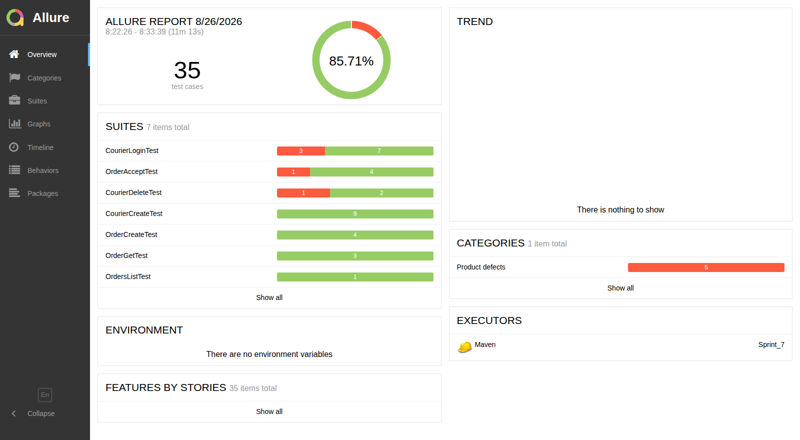

# 👋 Привет! Я Татьяна Ковалева
### QA-инженер — ручное и автоматизированное тестирование

📍 Санкт-Петербург · 💼 Удалённо / Гибрид / Офис · 📄 [Резюме на hh.ru](https://spb.hh.ru/resume/3cd2702aff0f33f5f40039ed1f36713152506c?hhtmFrom=applicant_profile)

---

## 🎯 Коротко обо мне

- **Ручное тестирование — сильная сторона.** Анализирую требования, составляю полную тестовую документацию: чек-листы, тест-кейсы, баг-репорты. В трёх проектах ниже — 291 проверка и 118 найденных дефектов.
- **Автоматизация на Java.** UI на Selenium с Page Object Model, API на REST Assured со Step Objects. Отчётность в Allure и JaCoCo, прогон в CI.
- **Технический бэкграунд.** Четыре года инженером связи в РЖД: мониторинг сетей, разбор аварий, работа с критичными системами. Понимаю SDLC и логику сложных систем не по учебнику.

---

## 🛠 Стек

| Категория | Инструменты |
|-----------|-------------|
| **Ручное тестирование** | Тест-анализ, тест-дизайн, чек-листы, тест-кейсы, баг-репорты, Figma |
| **Автоматизация UI** | Java 11, Selenium WebDriver, JUnit 4, Page Object Model, WebDriverManager |
| **Автоматизация API** | REST Assured, Step Objects, Jackson, Lombok |
| **Отчётность** | Allure, JaCoCo |
| **CI** | GitHub Actions, Maven |
| **Дополнительно** | Postman, SQL, DevTools, Git |

---

## 🤖 Портфолио: автоматизация

Во всех проектах тесты прогоняются в GitHub Actions при каждом пуше, отчёт публикуется автоматически — его можно открыть прямо в браузере, ничего не запуская.

Отчёт Allure по API Самоката: 35 тестов, 5 из них зафиксированы как дефекты стенда. Кликабельно — открывается живая версия.

| Проект | Что это | Тестов | Отчёт |
|--------|---------|-------:|-------|
| **[Samokat — API-автотесты](https://github.com/TatyanaKovalewa/samokat-api-autotests)** | REST Assured, курьеры и заказы. **Найдено 5 дефектов API** — разобраны в README | 35 | [Allure](https://tatyanakovalewa.github.io/samokat-api-autotests/) |
| **[Stellar Burgers — API-автотесты](https://github.com/TatyanaKovalewa/stellar-burgers-api-autotests)** | REST Assured, Step Objects: регистрация, авторизация, заказы | 20 | [Allure](https://tatyanakovalewa.github.io/stellar-burgers-api-autotests/) |
| **[Stellar Burgers — UI-автотесты](https://github.com/TatyanaKovalewa/stellar-burgers-ui-autotests)** | Selenium + Page Object Model, headless-Chrome и Яндекс.Браузер | 10 | [Allure](https://tatyanakovalewa.github.io/stellar-burgers-ui-autotests/) |
| **[Burger — unit-тесты](https://github.com/TatyanaKovalewa/burger-unit-tests)** | JUnit + Mockito, **100% покрытие**, планка зафиксирована в сборке | 80 | [JaCoCo](https://tatyanakovalewa.github.io/burger-unit-tests/) |
| **[Madagascar — unit-тесты](https://github.com/TatyanaKovalewa/madagascar-unit-tests)** | JUnit + Mockito, моки и параметризованные тесты, **100% покрытие** | 40 | [JaCoCo](https://tatyanakovalewa.github.io/madagascar-unit-tests/) |
| **[Samokat — UI-автотесты](https://github.com/TatyanaKovalewa/samokat-ui-autotests)** | Selenium + POM, Chrome и Firefox. **Найден дефект:** заказ не оформляется в Chrome, в Firefox проходит | 20 | [Allure](https://tatyanakovalewa.github.io/samokat-ui-autotests/) |

---

## 🧪 Портфолио: ручное тестирование

| Проект | Что это | Проверок | Найдено багов |
|--------|---------|---------:|---------------|
| **[Яндекс.Маршруты](./manual-testing/yandex-marshruty/README.md)** | Веб-приложение: вёрстка, функционал, оплата | 105 | **39** — 7 блокирующих, 14 критических |
| **[Яндекс.Прилавок](./manual-testing/yandex-prilavok/README.md)** | API сервиса доставки + Postman-коллекция | 110 | **60** |
| **[Яндекс.Метро](./manual-testing/yandex-metro/README.md)** | Мобильное приложение: функционал и регрессия | 76 | **19** — 2 блокирующих, 6 критических |

В каждом проекте — анализ требований, техники тест-дизайна (классы эквивалентности, граничные значения, предугадывание ошибок), полная тестовая документация и баг-репорты.

---

## 🐞 Баг-репорты

Дефекты, найденные при автоматизации. Каждый воспроизведён вручную, оформлен по всей форме и закрыт автотестом — **[все отчёты](./bug-reports/)**.

| ID | Название БР | Приоритет |
|----|-------------|-----------|
| [BUG1](./bug-reports/BUG1-login-bez-parolya-504.md) | Ошибка 504 Gateway Timeout через 60 секунд при отправке запроса `POST /api/v1/courier/login` на авторизацию курьера, если не передан пароль | 🔴 Критический |
| [BUG2](./bug-reports/BUG2-udalenie-kuriera-bez-id.md) | Ошибка 404 Not Found при отправке запроса `DELETE /api/v1/courier/{id}` на удаление курьера, если не передан id курьера | 🟡 Средний |
| [BUG3](./bug-reports/BUG3-prinyatie-zakaza-bez-id.md) | Ошибка 404 Not Found при отправке запроса `PUT /api/v1/orders/accept/{id}` на принятие заказа курьером, если не передан id заказа | 🟡 Средний |
| [BUG4](./bug-reports/BUG4-zakaz-ne-oformlyaetsya-v-chrome.md) | Не появляется сообщение «Заказ оформлен» при нажатии кнопки «Да» в окне подтверждения заказа в браузере Chrome | ⚫ Блокирующий |

В каждом отчёте — шаги воспроизведения, ожидаемый и фактический результат, контрольные запросы, отвергнутые гипотезы и ссылка на автотест.

---

## 💼 Опыт работы

**Инженер I категории, участок мониторинга и диагностики сети связи**
РЦС — структурное подразделение РЖД · *Май 2019 – Апрель 2023*

- Мониторинг технического состояния цифровых и аналоговых сетей связи
- Руководство ремонтно-восстановительными бригадами при авариях
- Сбор и анализ данных по отказам оборудования, отчётность для руководства
- Контроль технологических процессов, учёт вышедшего из строя оборудования
- Планирование и согласование работ с подразделениями и клиентами
- Работа с ПО оборудования: обновления, резервное копирование конфигураций

*Что из этого пригодилось в QA:* разбор инцидентов на работающей системе, приоритизация по критичности отказа, внятная отчётность о проблеме для тех, кто её будет чинить, и внимание к деталям в условиях ограниченного времени.

---

## 🎓 Образование

**Омский государственный университет путей сообщения (ОмГУПС)**, факультет ИАТИТ
Инженер связи, 2016

**Профессиональная переподготовка:**
- **Томский государственный университет** — «Специалист по тестированию ПО»: теория тестирования, Agile, Scrum
- **Яндекс.Практикум** — «Инженер по тестированию: от новичка до автоматизатора»: ручное и автоматизированное тестирование на Java
- **Интерактивный курс по SQL**

---

## 📬 Контакты

- Telegram: [@TNuss](https://t.me/TNuss)
- Email: nuss-tatyana@mail.ru
